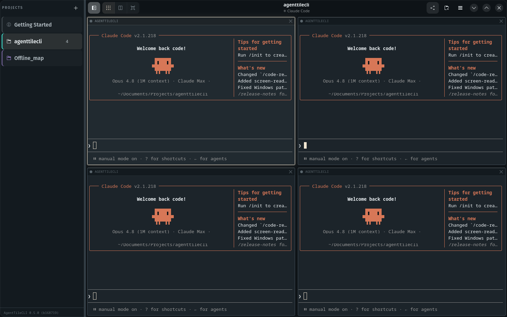

# AgentTileCLI

A native Linux dynamic tiling window manager for AI CLI sessions. Panes are
real terminals (VTE) that auto re-tile as you spawn, close, or promote them —
no manual resizing, though you can also drag any divider with the mouse if
you want to nudge it.



## Features

- **Project groups in a sidebar** — every project lives in its own group,
  each with its own independent tiling layout and set of agent panes.
  Toggle the sidebar with the button at the left of the header bar or
  `Super+Alt+g`, click a row to switch groups, and background groups keep
  their agents running while hidden. Drag a row to reorder it (or
  `Super+Alt+{` / `}`). Closing a group's row (✕) hangs up every agent in
  it; the **+** button in the header bar (or `Super+Alt+Return`) opens a new
  project as a new group via a native folder picker, and starts it with as
  many agents as the project you were last working in had running — pick the
  folder and it opens, with no second dialog asking a question you answer the
  same way every time. On a narrow window the sidebar stops squeezing the
  panes and slides over them instead.
- **Background agents tell you when they want you** — when an agent finishes a
  turn, or stops to ask permission, its group's sidebar row pulses and then
  stays quietly tinted until you open that group, so a finished agent in a
  project you aren't watching doesn't sit there unnoticed. The sidebar
  button pulses with it, since the sidebar is usually closed — it says *a*
  project wants you, and the row behind it says which. Panes launch
  `claude` with `Stop` and `Notification` hooks that ring the terminal bell;
  they're layered on per-pane via `--settings`, so your `~/.claude` config is
  never modified and your `claude` in other terminals is unaffected. The bell
  is visual only — nothing beeps, however many agents are running.
- **Grid mode by default** — every pane gets an equal-size cell, whatever the
  pane count: the grid shape (rows/columns) recomputes as you open/close
  panes, orienting itself to the window's own aspect ratio, and a partial
  last row keeps its panes the same size as every other row rather than
  stretching them to fill the gap — and sits centred in that leftover space,
  so three panes read as three panes rather than as four with one missing.
- **A grid you've arranged stays arranged** — drag a seam and those
  proportions survive the window being resized around them, including a
  resize drastic enough that the grid would otherwise re-orient itself.
  Dragging is the one explicit thing you say about a layout, so only opening
  or closing a pane — which genuinely invalidates the arrangement — puts the
  cells back to equal.
- **Stays the size you set it** — adding panes never resizes the window;
  they tile smaller within whatever size you've given it.
- **dwm-style master-stack mode** — one larger master pane + a stack column,
  with a persistent adjustable ratio.
- **Monocle mode** — fullscreen the focused pane.
- **A header bar that tells you where you are** — the project you're in and
  the focused pane's title, and a three-way Grid / Master-stack / Monocle
  switch that both reports the current mode and changes it. Pressing
  `Super+Alt+Tab` moves the switch, and clicking the switch is the same as
  pressing the key; the mode is no longer something you have to infer from
  the shape of the tiles.
- **Mouse support** — click any pane to focus it, drag any seam between
  panes to resize, click the ✕ in a pane's corner to close it, the sidebar
  button (header bar, far left) to toggle the sidebar, or the **new-agent**
  button (header bar, right) to spawn another pane.
- **Per-project panes** — the **new-agent** button spawns another agent in
  the current group's project directly, no picker. Each pane's corner shows
  the folder name it's running in. A new pane doesn't take your keyboard:
  you start a second agent *while* working in the first, and having focus
  jump mid-sentence sends the rest of that sentence somewhere you weren't
  looking. Click it, or `Super+Alt+j`, when you actually want it.
- **Paste, including screenshots** — `Ctrl+V` pastes, and `Ctrl+C` copies the
  selection. If what you copied was an *image*, `Ctrl+V` writes it out as a PNG
  and types its short path (`~/.cache/atc/img/mfd0j1.png`) into the prompt, so
  claude reads the picture from there — no `wl-clipboard` or `xclip` needed,
  since the image comes from GTK rather than a command-line clipboard tool. An
  image on the clipboard always wins over text; `Shift+Insert` is there for the
  rare case you want the text out of a clipboard that also holds a picture.
  `Ctrl+C` only copies when there's a selection — with nothing selected it stays
  the interrupt that stops a running agent, so clear the selection (one click)
  if a stale one is in the way.
- **One-click updates** — **Check for updates**, at the bottom of the sidebar
  (or `Super+Alt+u`), checks `origin/master` for a newer version, shows you
  what's new, and can pull and reinstall it for you in a pane so you can watch
  the build. It only touches your clone if it's a clean checkout of `master` —
  a dev branch, local commits, or uncommitted changes get reported, never
  overwritten. The version and commit you're actually running sit right
  beneath the button.
- **Keyboard shortcuts, in a dialog** — every binding, drawn as real key caps,
  on `Super+Alt+/` or from the menu. It's generated from the same table the
  app matches keypresses against, so it can't drift out of date, and it costs
  you no pane to read.
- **Adjustable text size** — enlarge or shrink every pane's terminal text
  together, independent of pane layout.

## Keybindings

All bindings are held with **Super+Alt** together, so they never collide with
your desktop environment's own `Super+key` shortcuts.

| Keys | Action |
|---|---|
| `Return` | open a new project as a new group |
| `g` | toggle the project sidebar |
| `[` / `]` | switch to the previous / next group |
| `{` / `}` | move this project up / down the sidebar |
| `Shift+Return` | promote focused pane to master (zoom) |
| `j` / `k` | focus next / previous pane |
| `w` | close the focused pane |
| `h` / `l` | shrink / grow the master column (MasterStack mode) |
| `i` / `d` | more / fewer master panes (MasterStack mode) |
| `m` | toggle monocle (focused pane fullscreen) |
| `Tab` | cycle layout mode: grid → master-stack → monocle |
| `=` / `-` | enlarge / shrink terminal text (all panes) |
| `0` | reset terminal text size |
| `/` | show the keyboard shortcuts |
| `u` | check for updates |

## Requirements

- `git`, `pkg-config`, GTK4 (>= 4.12), libadwaita (>= 1.5), and the
  GTK4-flavored VTE terminal widget (>= 0.65), including their dev files:

  | Distro | Install command |
  |---|---|
  | Arch / CachyOS / Manjaro | `sudo pacman -S git pkgconf gtk4 vte4 libadwaita` |
  | Fedora | `sudo dnf install git pkg-config gtk4-devel vte291-gtk4-devel libadwaita-devel` |
  | Debian / Ubuntu (trixie/24.10+ or newer) | `sudo apt install git pkg-config libgtk-4-dev libvte-2.91-gtk4-dev libadwaita-1-dev` |

  The libadwaita floor is 1.5, which is older than every release in the table
  above — the app deliberately builds against the 1.5 API rather than the
  newest one so that requiring it costs no distro its place here.

  Debian's GTK4-flavored VTE package didn't land until fairly recently, so
  older releases (e.g. Debian 12 "bookworm", which also ships a GTK4 below
  the 4.12 floor above) won't have it — use a newer release, backports, or
  build VTE from source.
- Rust 1.85 or newer (needed for the 2024 edition) — already met by current
  Debian, Fedora, and Arch packages:

  | Distro | Install command |
  |---|---|
  | Any (rustup, recommended) | `curl --proto '=https' --tlsv1.2 -sSf https://sh.rustup.rs \| sh` |
  | Arch / CachyOS / Manjaro | `sudo pacman -S rust` |
  | Fedora | `sudo dnf install rust cargo` |
  | Debian / Ubuntu (trixie/24.10+ or newer) | `sudo apt install rustc cargo` |
- By default, each pane runs the `claude` CLI in your login shell.
  `install.sh` offers to install it for you via Anthropic's official native
  installer if it isn't already on your `PATH`. Without it, panes just show
  your shell's "command not found" and exit — AgentTileCLI still works fine
  as a general terminal tiler. To install (or update) it yourself:

  ```sh
  curl -fsSL https://claude.ai/install.sh | bash
  ```

## Install

```sh
git clone https://github.com/pl0xuee/agenttilecli.git
cd agenttilecli
./install.sh
```

This builds a release binary and installs it to `~/.local/bin/agenttilecli`
(make sure that's on your `PATH`), plus adds an icon and a desktop entry so
it shows up in your application launcher.

To update later, open the sidebar (the button at the left of the header bar)
and click **Check for updates** at the bottom of it — or press `Super+Alt+u`,
or pick it from the app menu. It checks
`origin/master`, shows you what's new, and runs the pull and reinstall in a
pane. Or do it by hand: `git pull && ./install.sh`.

Keep the clone around either way: the update button pulls and rebuilds *it*,
so deleting it means updating by re-cloning instead.

## Uninstall

```sh
rm ~/.local/bin/agenttilecli \
   ~/.local/share/applications/dev.agenttilecli.AgentTileCli.desktop \
   ~/.local/share/icons/hicolor/scalable/apps/agenttilecli.svg
```
