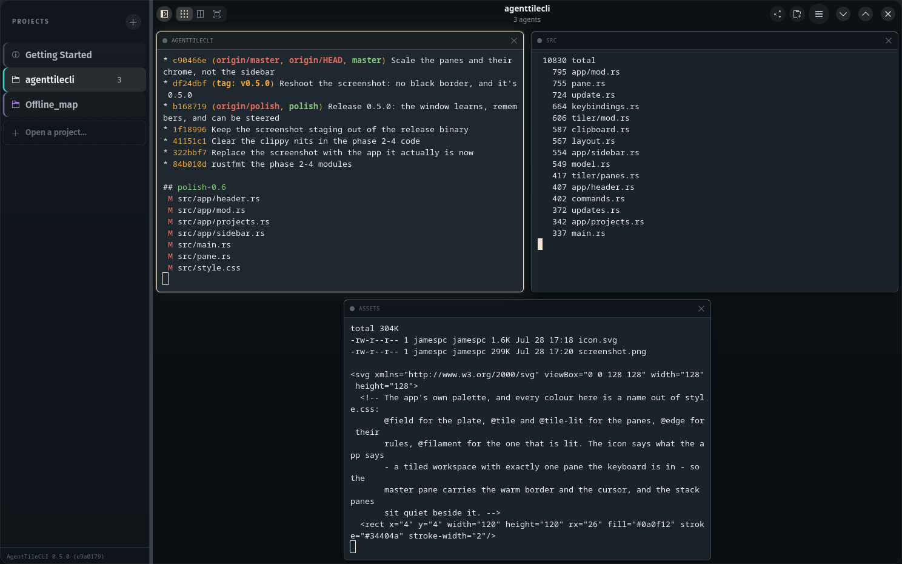

# AgentTileCLI

A native Linux dynamic tiling window manager for AI CLI sessions. Panes are
real terminals (VTE) that auto re-tile as you spawn, close, or promote them —
no manual resizing, though you can also drag any divider with the mouse if
you want to nudge it.



## Features

- **Project groups on a rail, detailed in a drawer** — every project lives in
  its own group, each with its own independent tiling layout and set of agent
  panes. The rail on the window's left edge is always on screen: one glyph
  per project, wearing that project's identity colour, pulsing amber when a
  background agent wants you, lit for the group you're in. Click a glyph to
  switch groups; click the lit one (or `Super+Alt+g`, or the header-bar
  button) to summon the drawer — the full rack, with names, per-agent tally
  dots, folder trees, and each group's ✕ (closing a group hangs up every
  agent in it). Background groups keep their agents running while hidden.
  Drag a row to reorder it (or `Super+Alt+{` / `}`), and drag the seam on the
  drawer's right edge to make it wider or narrower. The dashed **+** at the
  rail's foot (or `Super+Alt+Return`, or the drawer's "Open a project…" row)
  opens a new project as a new group via a native folder picker, and starts
  it with as many agents as the project you were last working in had running
  — pick the folder and it opens, with no second dialog asking a question you
  answer the same way every time. On a narrow window the rail stays put and
  the drawer floats over the panes as a near-opaque sheet instead of
  squeezing them.
- **Every project's files, in the rack** — a chevron beside a project's icon
  unfolds its folder tree right inside the sidebar strip, one level at a time.
  Each unfold re-reads that level from disk: the agents' whole job is changing
  these files, so a tree cached at startup would be wrong within a minute. A
  folder nobody opens costs nothing — `target/` with its hundred thousand
  artefacts is one lazy row until you click it, and shows at most 100 entries
  with a "+N more" note if you do. Folders sort first, dotfiles stay hidden,
  and a project whose folder has vanished says "unreadable" rather than
  pretending to be empty.
- **Click a file and it opens as a tile** — an editor pane wearing the same
  frame, head strip, dot and ✕ as every other tile, docked at the workspace's
  left edge; the agents tile in what remains, under whatever layout mode is
  set. Syntax highlighting (GtkSourceView), line numbers, and lines wrapped to
  the tile's width, since these tiles get narrow the moment another agent
  arrives. The strip's verbs are undo, redo and save, and the dot speaks the
  vocabulary the other dots already do — amber is "waiting on you", which for
  a buffer means unsaved changes. One editor per project: the first file opens
  it, every later click switches what it holds, asking Save / Discard /
  Keep editing first if there's unsaved work, exactly as closing does. It is
  deliberately not an agent — broadcast typing skips it, the sidebar's tally
  doesn't count it, and reopening a session never starts a `claude` for it.
  What it won't open it refuses out loud, as a toast naming the reason: a
  file that isn't UTF-8 text (editing would corrupt it), or one past 2 MB.
- **Every pane says what its agent is doing** — a dot in each pane's head
  strip: hollow while it starts, green while it works (hover it to see which
  tool), amber when it stops to ask you something, red when it has exited. The
  sidebar tally takes the most urgent answer in the group, so a project whose
  agent is blocked on a permission prompt says so in amber from across the
  window. It comes from claude's own hooks over a private socket rather than
  from the terminal output, so it knows *which* pane and *which* tool — and if
  the socket can't be opened, panes fall back to the bell below and nothing
  breaks.
- **Claude and Codex, side by side** — the chevron beside the header's **+**
  picks which agent to start, and a project can hold both at once: a claude and
  a codex tiled in the same folder, each with its own dot. The group remembers
  what you last chose, so picking codex once is a statement about that project
  rather than about that click, and the **+** keeps its single click. Each
  pane's head strip names its agent after whatever it was already saying —
  `working · Bash · codex`. Codex reports through the same six moments claude
  does (it spells one of them `PermissionRequest` rather than `Notification`),
  so the dots, the tally and the amber "wants you" all mean the same thing
  whichever agent is running. Getting hooks in front of codex takes more work
  than claude's `--settings`, because codex reads them only from its home
  directory: rather than write to yours, each pane runs against a `CODEX_HOME`
  of this app's own making — a cache directory of symlinks to your real one, so
  your auth, config and sessions are read through, with our `hooks.json` as the
  single real file beside them. `~/.codex` is never written to, and if you
  already keep hooks there they're merged in rather than replaced. One note: if
  your own hooks live inline in `~/.codex/config.toml` rather than in a
  `hooks.json`, codex will warn that it loaded both representations. It's
  harmless, and it's codex talking, not this app.
- **Background agents tell you when they want you** — when an agent finishes a
  turn, or stops to ask permission, its group's sidebar row pulses and then
  stays quietly tinted until you open that group, so a finished agent in a
  project you aren't watching doesn't sit there unnoticed. The sidebar
  button pulses with it, since the sidebar is usually closed — it says *a*
  project wants you, and the row behind it says which. Panes launch
  `claude` with `Stop` and `Notification` hooks that ring the terminal bell;
  they're layered on per-pane via `--settings`, so your `~/.claude` config is
  never modified and your `claude` in other terminals is unaffected. The bell
  is visual only — nothing beeps, however many agents are running.
- **Grid mode by default** — every pane gets an equal-size cell, whatever the
  pane count: the grid shape (rows/columns) recomputes as you open/close
  panes, orienting itself to the window's own aspect ratio, and a partial
  last row keeps its panes the same size as every other row rather than
  stretching them to fill the gap — and sits centred in that leftover space,
  so three panes read as three panes rather than as four with one missing.
- **A grid you've arranged stays arranged** — drag a seam and those
  proportions survive the window being resized around them, including a
  resize drastic enough that the grid would otherwise re-orient itself.
  Dragging is the one explicit thing you say about a layout, so only opening
  or closing a pane — which genuinely invalidates the arrangement — puts the
  cells back to equal.
- **Stays the size you set it** — adding panes never resizes the window;
  they tile smaller within whatever size you've given it.
- **dwm-style master-stack mode** — one larger master pane + a stack column,
  with a persistent adjustable ratio.
- **Monocle mode** — fullscreen the focused pane.
- **A header bar that tells you where you are** — the project you're in and
  the focused pane's title, and a three-way Grid / Master-stack / Monocle
  switch that both reports the current mode and changes it. Pressing
  `Super+Alt+Tab` moves the switch, and clicking the switch is the same as
  pressing the key; the mode is no longer something you have to infer from
  the shape of the tiles.
- **Mouse support** — click any pane to focus it, drag any seam between
  panes to resize, click the ✕ in a pane's corner to close it, the sidebar
  button (header bar, far left) to toggle the sidebar, or the **new-agent**
  button (header bar, right) to spawn another pane.
- **Per-project panes** — the **new-agent** button spawns another agent in
  the current group's project directly, no picker. Each pane's corner shows
  the folder name it's running in. A new pane doesn't take your keyboard:
  you start a second agent *while* working in the first, and having focus
  jump mid-sentence sends the rest of that sentence somewhere you weren't
  looking. Click it, or `Super+Alt+j`, when you actually want it.
- **Clickable links** — `Ctrl`-click a URL an agent printed and it opens in your
  browser. Both kinds work: OSC 8 hyperlinks, where the program says outright
  that some text is a link, and ordinary URLs found in plain output. `Ctrl`
  rather than a plain click on purpose — an ordinary click already means "focus
  this pane, put the cursor here", and a terminal where a stray click can launch
  a browser is one you get wary of clicking in. The pointer changes shape over a
  link to say it's there. Only `http`, `https` and `ftp` are ever handed to the
  desktop; terminal output isn't a trustworthy source of URIs.
- **Paste, including screenshots** — `Ctrl+V` pastes, and `Ctrl+C` copies the
  selection. If what you copied was an *image*, `Ctrl+V` writes it out as a PNG
  and types its short path (`~/.cache/atc/img/mfd0j1.png`) into the prompt, so
  claude reads the picture from there — no `wl-clipboard` or `xclip` needed,
  since the image comes from GTK rather than a command-line clipboard tool. An
  image on the clipboard always wins over text; `Shift+Insert` is there for the
  rare case you want the text out of a clipboard that also holds a picture.
  `Ctrl+C` only copies when there's a selection — with nothing selected it stays
  the interrupt that stops a running agent, so clear the selection (one click)
  if a stale one is in the way.
- **One-click updates** — **Check for Updates**, in the app menu (or
  `Super+Alt+u`), checks `origin/master` for a newer version, shows you what's
  new, and can pull and reinstall it for you in a pane so you can watch the
  build. It only touches your clone if it's a clean checkout of `master` — a
  dev branch, local commits, or uncommitted changes get reported, never
  overwritten. If a check finds something, the menu button stays tinted green
  and the item renames itself, so dismissing the dialog with "Not now" doesn't
  also dismiss the fact. The version and commit you're actually running sit at
  the bottom of the sidebar.
- **Keyboard shortcuts, in a dialog** — every binding, drawn as real key caps,
  on `Super+Alt+/` or from the menu. It's generated from the same table the
  app matches keypresses against, so it can't drift out of date, and it costs
  you no pane to read.
- **It reopens where you left it** — quit and relaunch and your projects come
  back, in the order you had them, with the layout mode and master ratio each
  one was using, at the window size and sidebar width you last set. Written to
  `$XDG_STATE_HOME/agenttilecli/session.json` a moment after anything changes,
  so a crash costs at most the last second or two. Agents are deliberately
  *not* restarted: an agent is a process with a token budget attached, and "I
  quit with four running" is not the same thing as "start four now" — each
  project reopens with its layout and an empty state telling you what to press.
- **Broadcast typing** — the broadcast button in the header bar (top-right)
  echoes whatever you type into the focused pane to every other agent in the
  project, so one instruction can go to all of them at once. It's a toggle, and
  it turns the header control solid amber while it's on — typing one line into
  four agents is exactly what it's for and exactly what makes it easy to do by
  accident, so it's built to be impossible to leave on without noticing. Per
  project, and never remembered across a restart.
- **Copy a pane's output** — `Super+Alt+C` puts everything the focused agent
  has printed onto the clipboard, so you can paste a whole exchange somewhere
  else without selecting it by hand.
- **Find in a pane** — `Super+Alt+F` opens a search bar over the focused pane
  and searches its scrollback, wrapping around, case-insensitively. Enter for
  the next match, `Shift+Enter` for the previous, `Escape` to close and hand the
  keyboard back. What you type is taken literally, so a path or an error message
  pasted straight in finds that line instead of failing to compile as a regex.
- **Adjustable text size** — enlarge or shrink every pane's terminal text
  together, independent of pane layout.
- **A command palette** — `Super+Alt+P` opens a search box over everything the
  app can do, plus every open project. Type a few letters of what you want and
  press Enter; the match is by subsequence, so `nxp` finds "switch to the next
  project". It's generated from the same table the keybindings and the
  cheatsheet come from, so nothing the app can do is missing from it. It's on
  `Super+Alt+P` rather than the usual `Ctrl+Shift+P` because that combination
  belongs to whatever is running inside a pane.
- **Preferences you can see while you set them** — window and pane opacity and
  the space around tiles, applied as you move them, with the window behind the
  dialog as the preview. They're remembered in your session; `config.toml` still
  says what the app opens as.
- **Glass chrome, solid panes by default** — the gutters, the header strip and the
  project rack are translucent to your desktop; the terminals are opaque, so agent
  output never competes with a wallpaper. Take the terminals to glass as well if
  you want that — `pane_opacity`, or the slider in Preferences.

## Configuration

Optional. Everything has a working default, and the file doesn't exist until
you make it:

```toml
# ~/.config/agenttilecli/config.toml

default_agent = "claude"  # which agent the + starts: claude or codex
agents = 1                # agents a newly-opened project starts with
restore_agents = false    # reopen a saved session's agents too?
gap = 6                   # half the space between tiles, in pixels
scrollback = 10000        # lines of scrollback per pane
font = "Fira Mono 10"     # terminal font; "" for your desktop's monospace
window_opacity = 0.92     # the gutters, the header strip and the rack
pane_opacity = 1.0        # the terminal surfaces themselves

[agent.claude]
command = "claude"        # what a claude pane runs

[agent.codex]
command = "codex"         # what a codex pane runs
```

A mistake in it — a typo'd key, broken TOML — is reported when the app starts,
with the line and column, rather than silently ignored.

The old top-level `command` key still works and still means claude's command,
so an existing config file needs no editing. It says so on startup and points
at `[agent.claude]`, which is where it lives now.

`restore_agents` is off on purpose. An agent is a process with a token budget
attached, so reopening a project restores its *layout* and leaves the panes to
you; turn this on if you'd rather it started them.

The two opacities are clamped to `0.5`–`1.0`, and the panes default to fully
opaque deliberately: a terminal is the one surface here whose job is being read.
`window_opacity` is 0.92 rather than something more dramatic for a related
reason — the floor is meant to sit *below* the panes, and a translucent surface
over a bright desktop climbs toward that desktop while the opaque panes stay
put, so past about 0.93 against a very light wallpaper the floor stops reading
as the floor. On a dark desktop you can go a good deal lower. Whether the
translucency is *blurred* is your compositor's business, not the app's.

If you do take `pane_opacity` down, what you are spending is contrast. Terminal
text sits at 13.6:1 against its own surface while the pane is opaque; over a
*white* desktop that falls to about 5:1 at `0.7`, crosses the 4.5:1 that normal
text wants at roughly `0.66`, and is down to 2.7:1 at the `0.5` floor. Over a dark
desktop it stays above 6.8:1 the whole way. Which is to say: how low you can go is
a fact about your wallpaper, not about the app — so the slider applies live, and
your own eyes are the guard.

The three appearance settings are also in Preferences, and what you set there is
remembered in your session rather than written back here — this file is meant to
be commented, and saving over it would delete what you'd written. Only values
you actually change are remembered, so editing this file keeps working.

Your session (which projects are open, their order, each one's layout mode and
ratios, the window size) is remembered separately in
`~/.local/state/agenttilecli/session.json`. That one is machine-managed — you
shouldn't need to touch it.

## Keybindings

All bindings are held with **Super+Alt** together, so they never collide with
your desktop environment's own `Super+key` shortcuts.

| Keys | Action |
|---|---|
| `Return` | open a new project as a new group |
| `g` | toggle the project sidebar |
| `[` / `]` | switch to the previous / next group |
| `{` / `}` | move this project up / down the sidebar |
| `Shift+Return` | promote focused pane to master (zoom) |
| `j` / `k` | focus next / previous pane |
| `w` | close the focused pane |
| `h` / `l` | shrink / grow the master column (MasterStack mode) |
| `i` / `d` | more / fewer master panes (MasterStack mode) |
| `m` | toggle monocle (focused pane fullscreen) |
| `Tab` | cycle layout mode: grid → master-stack → monocle |
| `=` / `-` | enlarge / shrink terminal text (all panes) |
| `0` | reset terminal text size |
| `f` | find in the focused pane |
| `c` | copy the focused pane's output |
| `p` | show all commands |
| `/` | show the keyboard shortcuts |
| `u` | check for updates |

A few things have no key of their own and live in the command palette (`p`) and
the app menu: starting another agent, toggling broadcast, choosing a layout mode
by name, and Preferences.

## Requirements

- `git`, `pkg-config`, GTK4 (>= 4.16), libadwaita (>= 1.7), the GTK4-flavored
  VTE terminal widget (>= 0.70), and GtkSourceView 5 (the sidebar's file
  editor), including their dev files:

  | Distro | Install command |
  |---|---|
  | Arch / CachyOS / Manjaro | `sudo pacman -S git pkgconf gtk4 vte4 libadwaita gtksourceview5` |
  | Fedora | `sudo dnf install git pkg-config gtk4-devel vte291-gtk4-devel libadwaita-devel gtksourceview5-devel` |
  | Debian / Ubuntu (trixie/25.04+ or newer) | `sudo apt install git pkg-config libgtk-4-dev libvte-2.91-gtk4-dev libadwaita-1-dev libgtksourceview-5-dev` |

  The libadwaita floor is 1.7, which is what Debian trixie — the oldest
  release in the table — ships; the app deliberately builds against the 1.7
  API rather than the newest one so that requiring it costs no distro its
  place here.

  Debian's GTK4-flavored VTE package didn't land until fairly recently, so
  older releases (e.g. Debian 12 "bookworm", which also ships a GTK4 below
  the 4.16 floor above) won't have it — use a newer release, backports, or
  build VTE from source.
- Rust 1.85 or newer (needed for the 2024 edition) — already met by current
  Debian, Fedora, and Arch packages:

  | Distro | Install command |
  |---|---|
  | Any (rustup, recommended) | `curl --proto '=https' --tlsv1.2 -sSf https://sh.rustup.rs \| sh` |
  | Arch / CachyOS / Manjaro | `sudo pacman -S rust` |
  | Fedora | `sudo dnf install rust cargo` |
  | Debian / Ubuntu (trixie/24.10+ or newer) | `sudo apt install rustc cargo` |
- By default, each pane runs the `claude` CLI in your login shell.
  `install.sh` offers to install it for you via Anthropic's official native
  installer if it isn't already on your `PATH`. Without it, panes just show
  your shell's "command not found" and exit — AgentTileCLI still works fine
  as a general terminal tiler. To install (or update) it yourself:

  ```sh
  curl -fsSL https://claude.ai/install.sh | bash
  ```

## Install

```sh
git clone https://github.com/pl0xuee/agenttilecli.git
cd agenttilecli
./install.sh
```

This builds a release binary and installs it to `~/.local/bin/agenttilecli`
(make sure that's on your `PATH`), plus adds an icon and a desktop entry so
it shows up in your application launcher.

To update later, open the sidebar (the button at the left of the header bar)
and click **Check for updates** at the bottom of it — or press `Super+Alt+u`,
or pick it from the app menu. It checks
`origin/master`, shows you what's new, and runs the pull and reinstall in a
pane. Or do it by hand: `git pull && ./install.sh`.

Keep the clone around either way: the update button pulls and rebuilds *it*,
so deleting it means updating by re-cloning instead.

## Uninstall

```sh
rm ~/.local/bin/agenttilecli \
   ~/.local/share/applications/dev.agenttilecli.AgentTileCli.desktop \
   ~/.local/share/icons/hicolor/scalable/apps/agenttilecli.svg
```
